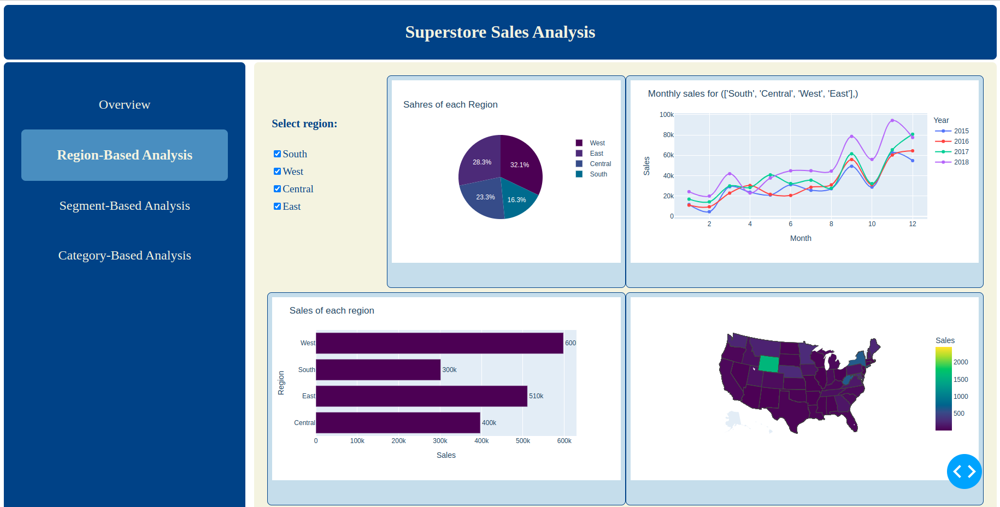

# Superstore Sales Plotly Dashboard
This project involves analyzing superstore sales data and visualizing the results through an engaging, interactive Plotly dashboard.



## Installation

This package is tested on Ubuntu 20.04 with Python 3.9.12. To run the app in your local system, first create your virtual environment:

```shell
python -m venv venv
source venv/bin/activate
```
Next, install all dependencies:

```shell
pip install -r requirements.txt
```

## Data
This analysis and dashboard is developed based on this kaggle dataset:  <br>  
https://www.kaggle.com/datasets/bhanupratapbiswas/superstore-sales/data <br>  

## Run The App
To run the interactive dashboard on your local system, you can run:

```shell
python app.py
```
